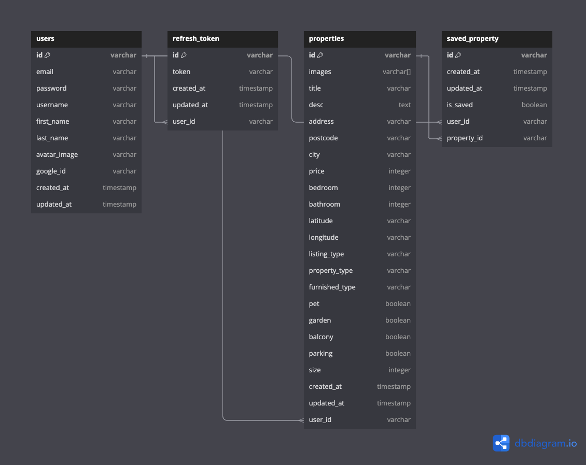

# About

Movpla is a full-stack property portal web application

# Frontend Tech

React, Next.js, TypeScript, TailwindCSS, Shadcn UI, React Query, Axios, React-Leaflet, Zustand, React-hook-form

# Backend Tech

Express, TypeScript, PostgreSQL, Prisma, Cloudinary, Passport.js, Socket.io, JSON Web Tokens (JWT)

### Database ORM



### Install packages

```shell
npm istall
```

### Setup .env file

```js
Frontend setup

NEXT_PUBLIC_APP_URL=
NEXT_PUBLIC_SERVER_URL=

Backend setup

PORT=
DATABASE_URL=
SERVER_URL=
CLIENT_URL=
CLOUDINARY_CLOUD_NAME=
CLOUDINARY_API_KEY=
CLOUDINARY_API_SECRET=
GOOGLE_CLIENT_ID=
GOOGLE_CLIENT_SECRET=
JWT_SECRET_KEY=
```

### Start the app

```shell
npm run dev
```

## Available commands

Running commands with npm `npm run [command]`

| command | description                              |
| :------ | :--------------------------------------- |
| `dev`   | Starts a development instance of the app |
